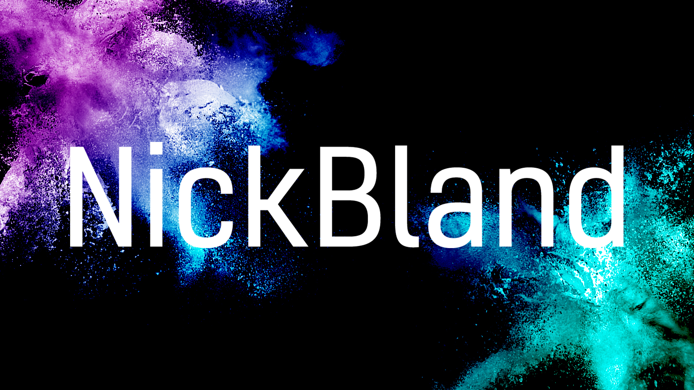
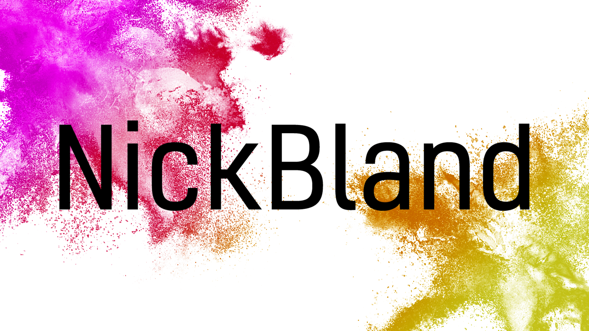
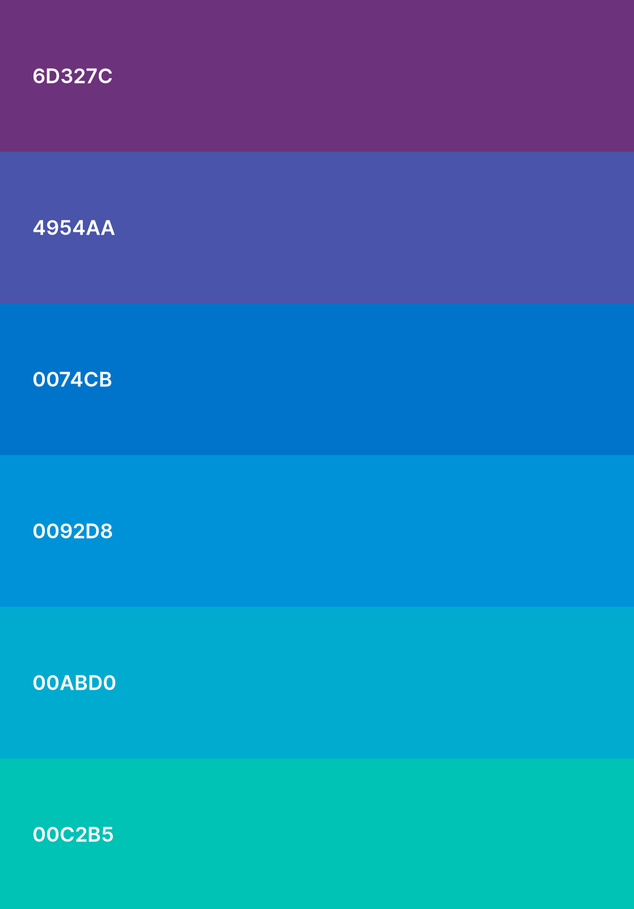
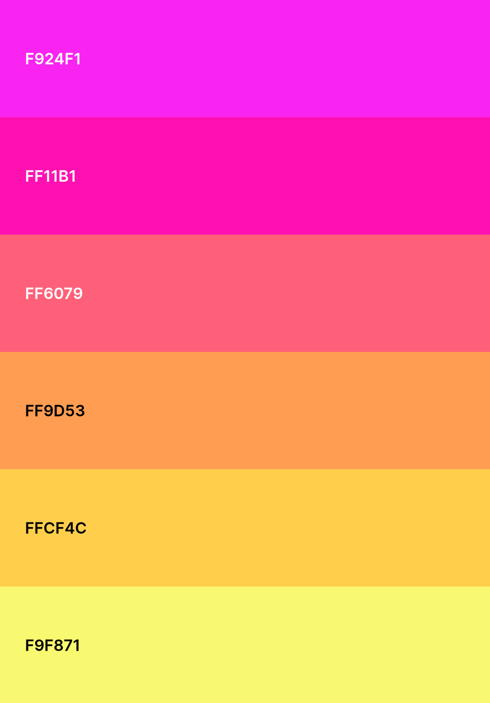

# Website-2.0

> A project to reface my old website.

## Aim of Project

The aim of the project is to simply make my website look more modern than it used to look. Originally I downloaded a template from some random website and worked off that. Sure it looked nice, but it wasn't really made by me. So, starting mostly from scratch, I'm rebuilding this website into something better than it was before. For reference, here is a picture of the website as of creating this project:

Really, I want to make something a lot more simple and use a more modern framework. While Rust is cool, it just isn't suited for this sort of project. Maybe in a few years time Rust will have matured enough to have easier web frameworks available. [Check here for more info on Rust development](https://www.arewewebyet.org/)

---

## Starting Off

Starting off, the easiest thing is creating a new logo. The previous logo is a screenshot of GTA 5 with a blur effect applied to make the text more visible. I'm a fan of the colourful visual style of this old logo, so wanted something as colourful, but with some more effort. With that said, I created the NickBland logo with an SVG creator, so it can scale infinitely, and created a colour bomb on each corner akin to something like the Festival of Colours in India. Additionally, a light and dark theme was made since some people like the choice; photoshop files can be found in the repository. Here's the result:

### Themes

### Palettes

| Dark Theme | Light Theme |
| :-----: | :-----: |
|  |  |

---
