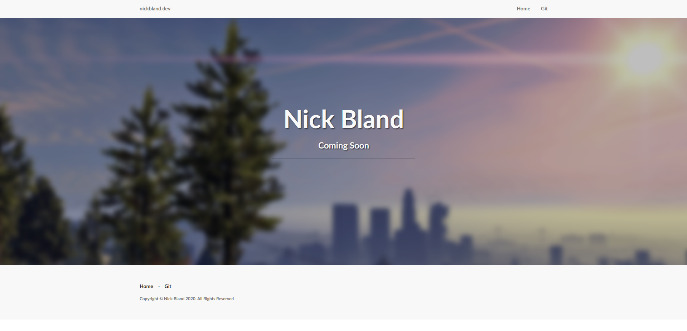

# Main-Website-Content

> An overall small project I plan to do to reface my current website

## Aim of Project

The aim of the project is to simply make my website look more modern than it used to look. Originally I downloaded a template from some random website and worked off that. Sure it looked nice, but it wasn't really made by me. So, starting mostly from scratch, I'm rebuilding this website into something better than it was before. For reference, here is a picture of the website as of creating this project:

Really, I want to make something a lot more simple and use a more modern framework. While Rust is cool, it just isn't suited for this sort of project. Maybe in a few years time Rust will have matured enough to have easier web frameworks available. [Check here for more info on Rust development](https://www.arewewebyet.org/)

---
