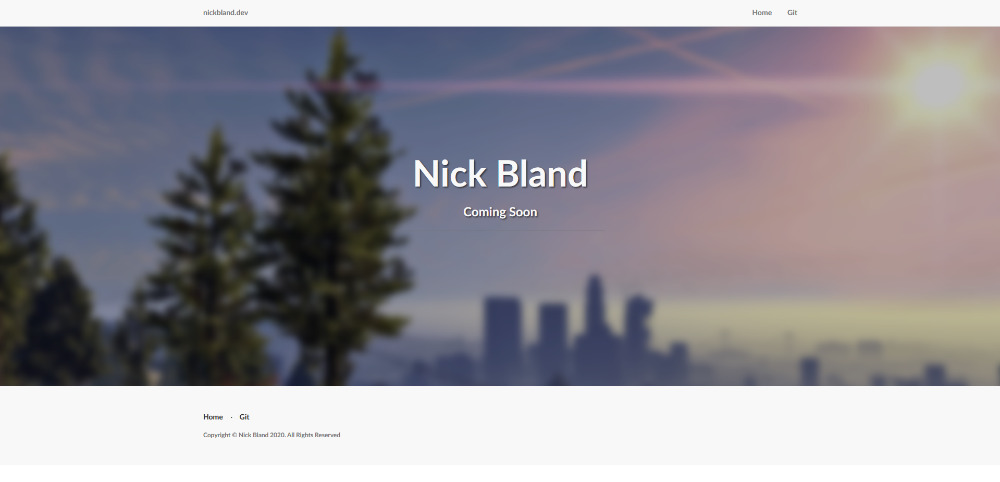
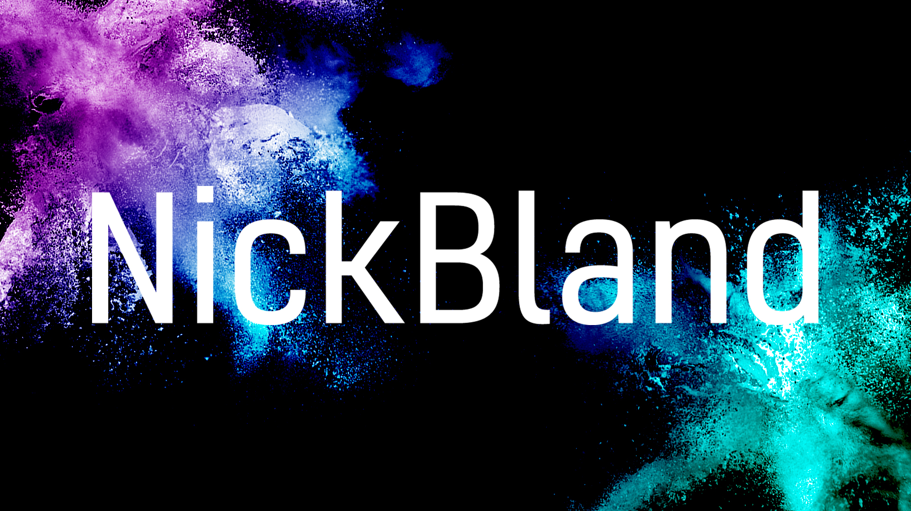
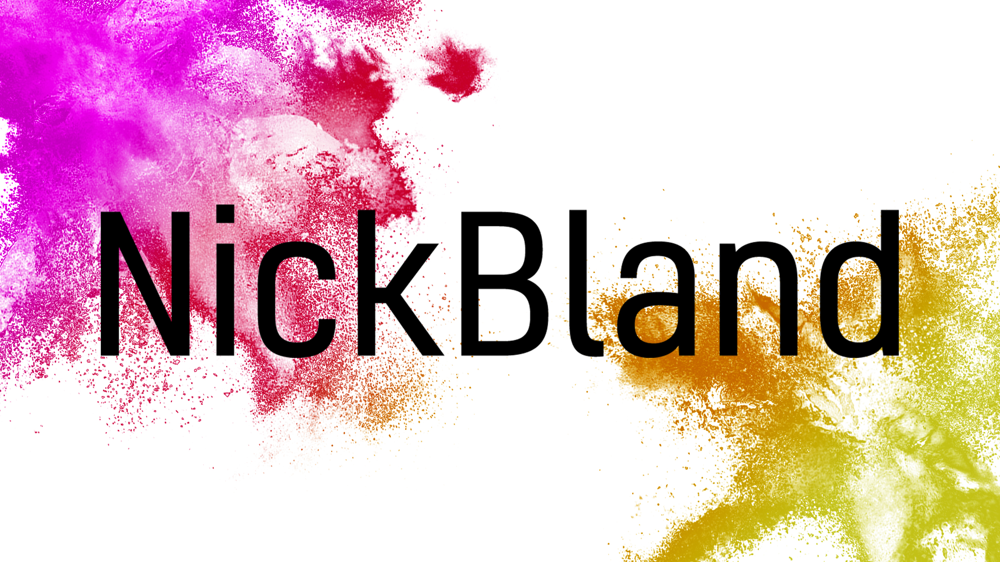

# Website-2.0

A project to reface my old website, and treat it as a portfolio.

## Aim of Project and Motivation

Originally I downloaded a template from some random website and worked off that to create my very first website. Sure it looked nice, but it wasn't really made by me. So, starting mostly from scratch, I'm rebuilding this website into something better than it was before. For reference, here is a picture of the website as of creating this project:

Another motivation behind the project is creating something more professional. For my endevours in the job-space, a portfolio site is an excellent foot in the door in showing an employer what you are capable of, and what you have done in your own time.

## Tools Used

I wanted to make something a lot simpler and use a more modern framework. So like every developer ~2020, my eyes were drawn immediately to rust. While Rust is cool, it just isn't suited for this sort of project. Maybe in a few years time Rust will have matured enough and have easier frameworks. [Check here for more information on the Rust web ecosystem](https://www.arewewebyet.org/)

Svelte seemed like the perfect mix between being something more modern than React, but with the familiarity of JavaScript and modern frameworks still present. Performance wise, it also holds up very well, and is a delight to work with.

## Starting Off

Starting off, the easiest thing is creating a new logo. The previous logo is a screenshot of GTA 5 with a blur effect applied to make the text more visible. I'm a fan of the colourful visual style of this old logo, so wanted something as colourful, but with some more effort to make it truly mine.

I created the NickBland logo with an SVG generator, so that it can scale infinitely, and added a colour bomb on each corner akin to something like the Festival of Colours in India. Here's the result:

In the exploratory phase of creating this theming, I initially wanted to create an animation where the burst would shoot out from either side of the screen -- at great expense to the user. While this seemed absolutely awesome in my head, I came to the realisation that people don't really care about that sort of stuff unless they can get to the content quickly.
